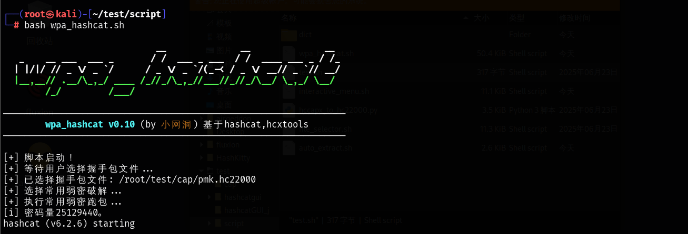

# wpa_hashcat

wpa_hashcat是基于hashcat与hcxtools封装，专用于解析WPA握手包的跑包工具。使用该工具您可以在linux环境下快速调用hashcat对捕获的WPA握手包进行暴力破解，以满足一些简单的跑包需求。

~~~
              .:::::::::::::.......::::::::::::::.       
            .::::::::::--::--*####+-:::--::::::::::.     
           ..::::::::::-#@@@@@@@@@@@@@@*-:::::::::::.    
           ..::::::::::.:%@@@@@@@@@@@@+.:::::::::::..    
           ..:::::::::::.=@@@@@@@@@@@@:::::::::::::..    
           ...::::::::::::@%*#@@@%#*@#.:::::::::::...    
           .....:::::::::.:*%#%@@%%%+.::::::::::.....    
           ...........::::..:-#@@+-:.:::::...........    
           ................:. #@@= ::................    
            .................:@@@*..................     
            ................ -@@@@..................     
             ............... *@@@@- ...............      
                .............@@@@@# ............         
                     ...... *@@@@@@- ......              
                        .  =@@@@@@@%.                    
                         .+@@@@@@@@@%-                   
                        :%@@@@@@@@@@@@#                  
                        %@@@@@@@@@@@@@@=                 
                        %@@@@@@@@@@@@@@+                 
                        .::::::::::::::.                 
           ...:.........               ..........::..                                                                                                                   
                            __               __              __ 
  _    __ ___  ___ _       / /  ___ _  ___  / /  ____ ___ _ / /_
 | |/|/ // _ \/ _ `/      / _ \/ _ `/ (_-< / _ \/ __// _ `// __/
 |__,__// .__/\_,_/ ____ /_//_/\_,_/ /___//_//_/\__/ \_,_/ \__/ 
       /_/         /___/                                        
—————————————————————————————————————————————————————————————————
                基于hashcat、hcxtools  (by 小网洞)    
—————————————————————————————————————————————————————————————————

~~~

## 使用方法

~~~
# 安装依赖
apt install hashcat hcxdumptool python3 xxd zip p7zip-full
# 导入项目并运行
git clone https://github.com/wangdong0/wpa_hashcat.git
cd wpa-hashcat
# 方式一
bash wpa_hashcat.sh
# 方式二
bash wpa_hashcat.sh <你的握手包路径>
~~~

> **【支持握手包格式】**
>
> *.cap ✅ | *.pcap ✅ | *.pcapng ✅ | *.hccapx ✅ | *.hc22000 ✅

**hashcat.rc**文件为运行hashcat的参数配置文件，设置了两个字段分别用于输出文件配置和优化参数配置，可根据需要进行修改。

- `HASHCAT_OUTPUT`：破解成功的密码输出文件（默认保存到wpa_hashcat_crack.txt中）。

- `HASHCAT_OPTS`：运行时使用的优化参数（默认不设置）。

## 预设说明

使用wpa_hashcat时您可以自选字典进行跑包，同时内置5种预设（主要针对国人的WiFi密码设置习惯）。

| 预设            | 版本 | 作者     | 密码量    | 说明                                         | 推荐度        |
| --------------- | ---- | -------- | --------- | -------------------------------------------- | ------------- |
| 常用弱密        | 1.0  | HULUGANG | ≈2500万   | 顺序字符、姓名、日期、谐音、数字字母组合等   | ⭐️⭐️⭐️⭐️⭐️（推荐） |
| 8位纯数字       | 1.0  | 小网洞   | 1亿       | 8位纯数字                                    | ⭐️⭐️⭐️⭐️⭐️（推荐） |
| 地区手机号      | 1.0  | 随风无限 | 20万~2亿  | 11位中国大陆移动、电信、联通手机号（2024年） | ⭐️⭐️⭐️⭐️⭐️（推荐） |
| 8位数字字母规律 | 1.0  | 小网洞   | ≈673亿    | 字母+数字、数字+字母、数字字母混合           | ⭐️⭐️            |
| 运营商光猫规律  | 1.0  | 随风无限 | ≈1万2千亿 | ChinaNet/CMCC/CU光猫默认密码规律             | ⭐️⭐️            |

## 免责声明

本项目仅用于无线安全审计，使用时请注意遵守相关法律法规。